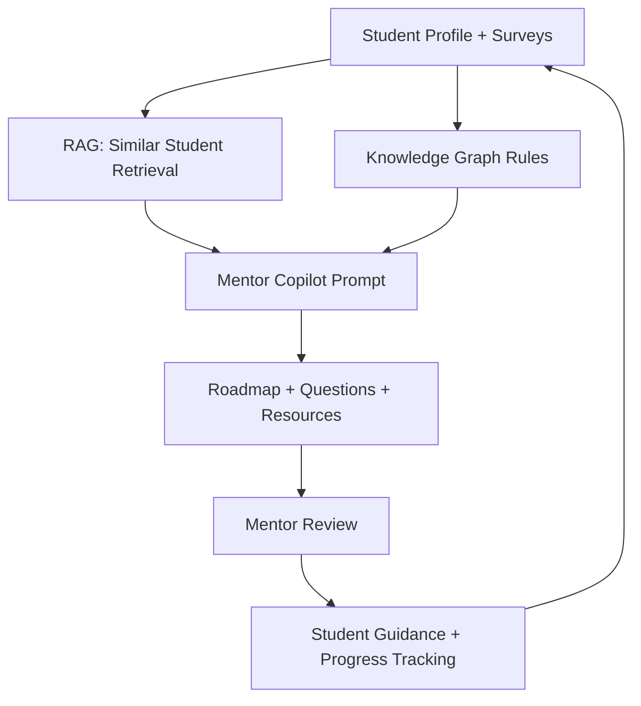
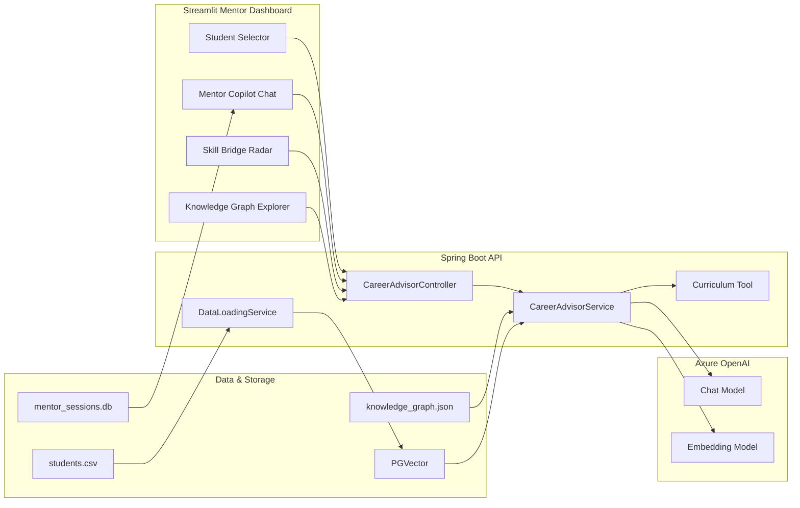

# graph-rag-mentor-copilot (Azure Exploration)

This is a **hands‑on exploration** project inspired by a hackathon I came across.  
It is **not** an official submission and **not** a product—just a practical prototype to learn Azure OpenAI, RAG, and lightweight Knowledge Graphs in a mentor‑support scenario.

The demo context represents a generic youth mentorship organization.

## Why this project
- Experiment with **Azure OpenAI** in a real‑world workflow
- Combine **RAG** (retrieval of similar student profiles) with **Knowledge Graph rules** (relational reasoning)
- Build a mentor‑oriented UI that is more than a simple chatbot

## Features
- Mentor dashboard with student selector + session persistence (SQLite)
- Mentor Copilot chat (mentor‑facing guidance + student‑ready responses)
- RAG over `students.csv` + JSON Knowledge Graph (GraphRAG‑style)
- Skill Bridge Radar (Plotly) + interactive Knowledge Graph explorer

## Tech Stack
- Backend: Spring Boot + Spring AI + Azure OpenAI + PGVector
- Frontend: Streamlit
- Storage: SQLite (mentor sessions), PostgreSQL (vector store)

## Quickstart

### 1) Backend
```bash
mvn spring-boot:run
```

### 2) Frontend
```bash
streamlit run app.py
```

### 3) UI dependencies
```bash
/opt/homebrew/bin/python3.11 -m pip install plotly streamlit-agraph
```

## Required Environment Variables
```bash
export AZURE_OPENAI_ENDPOINT="https://<your-resource>.openai.azure.com/"
export AZURE_OPENAI_API_KEY="<your-key>"
export AZURE_OPENAI_CHAT_DEPLOYMENT="gpt-4o"
export AZURE_OPENAI_EMBEDDING_DEPLOYMENT="text-embedding-ada-002"
```

## Project Structure
- `app.py` — Streamlit mentor dashboard + copilot chat
- `src/main/java/...` — Spring Boot backend services
- `src/main/resources/students.csv` — synthetic student profiles
- `src/main/resources/knowledge_graph.json` — interest→trait→skill→role rules
- `mentor_sessions.db` — mentor chat history (SQLite)

## Process Flow


## Architecture Diagram


## Notes
- This is a learning prototype inspired by a hackathon theme.
- It is not a production system.
