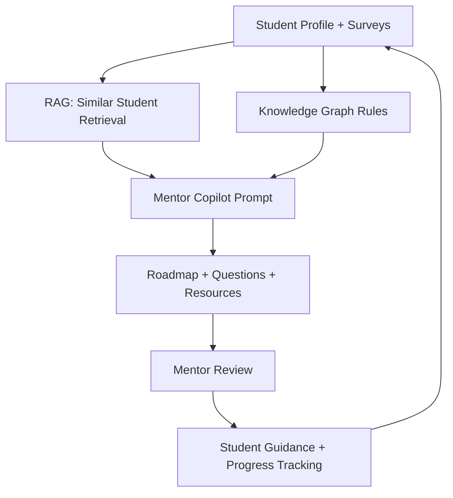
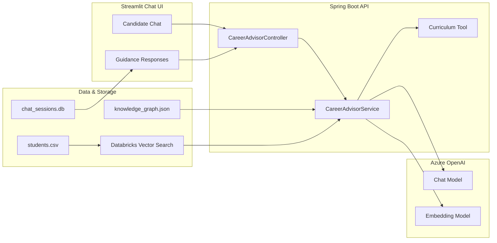

# MentorBridge (Graph‑RAG Mentor Copilot)

This is a **hands‑on exploration project**, inspired by a hackathon use‑case.
It is **not** an official submission and **not** a production product.

The goal is learning:

* how Azure AI services fit together
* how RAG + lightweight Knowledge Graphs improve guidance
* how AI can reduce *operational friction* without removing humans

The demo context represents a **generic youth mentorship and skilling organization**.

---

## Presentation Guide (Quick Narrative)

**1) The Problem**
- Young people want jobs, but onboarding and guidance are slow, manual, and inconsistent.
- Mentors spend too much time on admin tasks instead of coaching.

**2) The Solution**
- **Chat (MentorBridge)** helps candidates discover paths and get guidance.
- **Onboarding Velocity Engine** verifies documents quickly using AI.

**3) Why It Works**
- Consistent guidance (RAG + knowledge graph context).
- Faster onboarding (Document Intelligence + verification rules).
- Human oversight stays in the loop for low-confidence cases.

**4) What Success Looks Like**
- Faster candidate onboarding.
- Clear next steps for candidates.
- Better mentor time utilization.

---

## System Architecture (Simple)

**Frontends**
- **Chat UI** (Chat.py) – branded Magic Bus candidate chat.
- **Onboarding UI** (pages/Onboarding.py) – upload docs + verification.

**Backend (Spring Boot)**
- **Advisor API**: /api/advisor/advice – chat guidance.
- **Onboarding API**: /api/onboarding/verify – document verification.

**AI Services**
- **Azure OpenAI** – reasoning + responses.
- **Azure Document Intelligence** – Aadhaar/Income extraction.

**Storage**
- **Blob Storage** – stores onboarding submissions (JSON).
- **SQLite** – local chat sessions (optional demo persistence).

**RAG**
- **Databricks Vector Search** – retrieves similar student profiles for context.

---


## Why This Project Exists

This project explores two real problems:

1. **Mentor decision fatigue**
2. **Slow, manual onboarding workflows**

Instead of solving them with a single chatbot, we split responsibilities clearly.

---

## What This App Does (At a Glance)

* Dual‑purpose web app:

  * **Mentor Copilot** (guidance + reasoning)
  * **Onboarding Velocity Engine** (document verification)

* Mentor dashboard with:

  * student selector
  * session persistence (SQLite)

* AI‑assisted reasoning using:

  * RAG over `students.csv`
  * JSON Knowledge Graph rules

* Automated document verification using:

  * Azure AI Document Intelligence
  * human‑in‑the‑loop escalation on low confidence

---

## Tech Stack (Why Each Piece Exists)

### Backend

* **Spring Boot** – orchestration + business logic
* **Spring AI** – structured LLM access
* **Azure OpenAI** – reasoning + explanation
* **Databricks Vector Search** – similarity search (RAG)

### Frontend

* **Streamlit** – fast, explainable UI for demos

### Storage

* **SQLite** – mentor chat sessions
* **Databricks Vector Search index** – student profiles + vectors

---

## Quickstart (Run Locally)

### 1) Backend

```bash
mvn spring-boot:run
```

If this fails, nothing else will work.

---

### 2) Frontend

```bash
streamlit run Chat.py
```

Open the URL shown in the terminal.

---

### 3) UI Dependencies

```bash
pip install plotly streamlit-agraph
```

---

## Required Environment Variables

```bash
export AZURE_OPENAI_ENDPOINT="https://<your-resource>.openai.azure.com/"
export AZURE_OPENAI_API_KEY="<your-key>"
export AZURE_OPENAI_CHAT_DEPLOYMENT="gpt-4o"
export AZURE_OPENAI_EMBEDDING_DEPLOYMENT="text-embedding-ada-002"
export DATABRICKS_WORKSPACE_URL="https://adb-<workspace-id>.<region>.azuredatabricks.net"
export DATABRICKS_PAT="<your-databricks-pat>"
export DATABRICKS_VECTOR_SEARCH_INDEX="<catalog>.<schema>.<index_name>"
export DATABRICKS_VECTOR_SEARCH_TEXT_COLUMN="text"
```

Databricks Vector Search is used for RAG. If it is not configured, the app will run without RAG context.

---

## Databricks Vector Search Setup (One-time)

1) Create a Delta table that has a text column (default: `text`) with the student profile content.  
2) Create a Vector Search endpoint and index (Delta Sync index is simplest in the UI).  
3) Set `DATABRICKS_VECTOR_SEARCH_INDEX` to the full index name: `<catalog>.<schema>.<index_name>`.  

Databricks supports creating and querying Vector Search endpoints and indexes in the UI, Python SDK, or REST API. citeturn0search0

---

## Project Structure (Mental Map)

* `Chat.py`

  * Streamlit candidate chat UI

* `src/main/java/...`

  * Spring Boot APIs

* `src/main/resources/students.csv`

  * synthetic student profiles

* `src/main/resources/knowledge_graph.json`

  * interest → trait → skill → role rules

* `chat_sessions.db`

  * mentor chat history (SQLite)

---

## Mentor Copilot – Process Flow



**Key idea:**
AI assists mentors, mentors remain accountable.

---

## Mentor Copilot – Architecture



---

## Onboarding Velocity Engine

This module accelerates learner onboarding while keeping humans in control.

### What It Does

* Captures Aadhaar and income documents
* Extracts fields using **Azure AI Document Intelligence**
* Applies confidence‑based verification rules
* Escalates uncertain cases for human review

---

### Required Environment Variables

```bash
export AZURE_DOCINTEL_ENDPOINT="https://<your-resource>.cognitiveservices.azure.com"
export AZURE_DOCINTEL_KEY="<your-key>"
export AZURE_STORAGE_CONNECTION_STRING="<your-connection-string>"
export AZURE_STORAGE_CONTAINER="forms"
export POWER_AUTOMATE_WEBHOOK_URL="<your-flow-http-trigger-url>"
```

---

### Document Verification Logic (Current)

1. Azure Document Intelligence extracts:

   * FullName
   * DateOfBirth
   * DocumentNumber
   * Income (if present)

2. Java validation checks:

   * Normalized document name must match the `name` column in `students.csv`
   * Confidence score must be **≥ 0.90**

3. If any confidence < 0.90:

   * A webhook is sent for human review

---

## Dual‑Purpose Architecture (Mentor + Onboarding)

```mermaid
flowchart LR
    subgraph UI[Streamlit Web App]
        U1[Chat (MentorBridge)]
        U2[Onboarding Velocity Engine]
    end

    subgraph API[Spring Boot Services]
        A1[Advisor API]
        A2[Onboarding API]
    end

    subgraph AI[Azure AI]
        C1[Azure OpenAI]
        C2[Document Intelligence]
    end

    subgraph Data[Data Stores]
        S1[Databricks Vector Search]
        S2[students.csv]
        S3[SQLite Sessions]
        KG[Knowledge Graph JSON]
    end

    U1 --> A1 --> C1
    A1 --> S1
    A1 --> KG

    U2 --> A2 --> C2
    A2 --> S2
    A2 -->|Low confidence| P[Power Automate Alert]

    U1 --> S3
    U2 --> S3
```

---

## Important Notes

* This is a **learning prototype**
* No model fine‑tuning is performed
* All logic is explainable and inspectable

If you can explain:

* what problem is solved
* why AI is used
* where humans stay in control

Then the system is doing its job.
