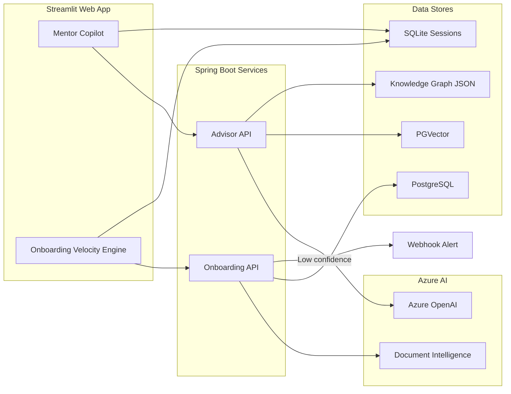
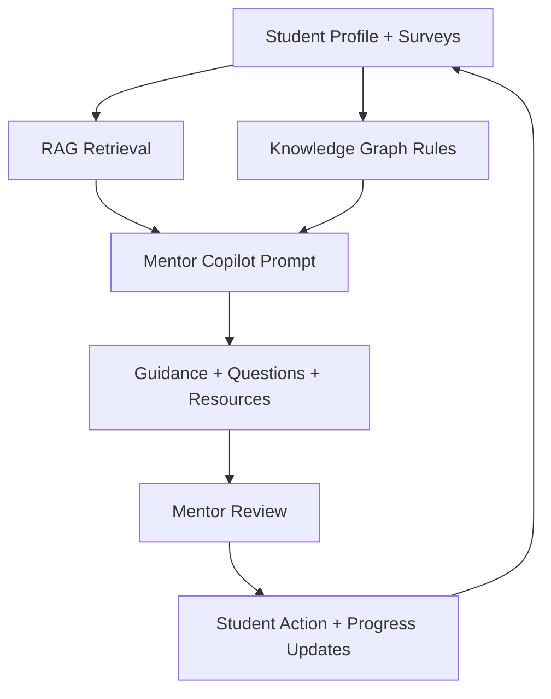
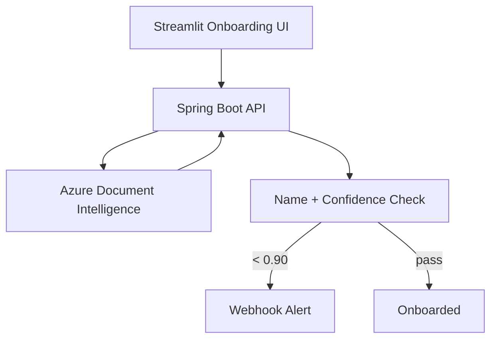

# MentorBridge (graph-rag-mentor-copilot)

A hands‑on Azure AI project inspired by a hackathon theme. This repo demonstrates a **dual‑purpose mentor facilitation platform**:

1) **Mentor Copilot** — RAG + Knowledge Graph reasoning for personalized guidance.
2) **Onboarding Velocity Engine** — document extraction + verification using Azure AI Document Intelligence.

> This is a prototype for learning and demo purposes. Not a production system.

---

## ✨ Features
- Mentor dashboard + copilot chat
- Knowledge Graph + RAG (GraphRAG‑style reasoning)
- Skill Bridge Radar
- Onboarding document verification (Aadhaar, PAN, income)
- Human‑in‑the‑loop escalation via webhook

---

## 🧱 Architecture (Mentor Copilot + Onboarding)


---

## 🔁 Process Flow


---

## ⚡ Quickstart

### 1) Backend (Spring Boot)
```bash
mvn spring-boot:run
```

### 2) Frontend (Streamlit)
```bash
streamlit run app.py
```

### 3) Python dependencies
```bash
/opt/homebrew/bin/python3.11 -m pip install plotly streamlit-agraph
```

---

## 🔐 Required Environment Variables

### Azure OpenAI (Mentor Copilot)
```bash
export AZURE_OPENAI_ENDPOINT="https://<your-resource>.openai.azure.com/"
export AZURE_OPENAI_API_KEY="<your-key>"
export AZURE_OPENAI_CHAT_DEPLOYMENT="gpt-4o"
export AZURE_OPENAI_EMBEDDING_DEPLOYMENT="text-embedding-ada-002"
```

### Azure Document Intelligence (Onboarding)
```bash
export AZURE_DOCINTEL_ENDPOINT="https://<your-resource>.cognitiveservices.azure.com"
export AZURE_DOCINTEL_KEY="<your-key>"
export POWER_AUTOMATE_WEBHOOK_URL="<your-flow-http-trigger-url>"
```

> If you don’t need human escalation, leave `POWER_AUTOMATE_WEBHOOK_URL` blank.

---

## ✅ Onboarding Verification Logic (Current)
1) Document Intelligence extracts:
   - `FullName`, `DateOfBirth`, `DocumentNumber`, and income (if present)
2) Java validation checks:
   - Names across Aadhaar, PAN, and income docs must match `student_profiles.full_name`
   - Confidence for each doc must be **>= 0.90**
3) Confidence < 0.90 → webhook alert

---

## 📄 Onboarding Flow Diagram


---

## 📁 Project Structure
- `app.py` — Mentor Copilot UI
- `pages/onboarding_velocity_engine.py` — Onboarding UI
- `src/main/java/...` — Spring Boot services
- `src/main/resources/students.csv` — synthetic student profiles
- `src/main/resources/knowledge_graph.json` — KG rules
- `mentor_sessions.db` — mentor chat history (SQLite)

---

## 🧪 Test Tips
- For onboarding: upload small dummy PNGs/PDFs (<10 MB) to avoid 413 errors.
- If Doc Intelligence isn’t configured yet, extraction returns empty fields (expected).

---

## 📝 License
MIT (update if needed).
